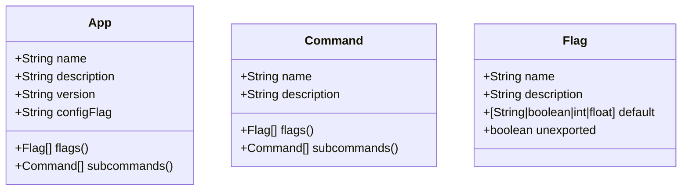

# go-cli-boilerplate
`go-cli-boilerplate` is a modular piece of Go code using which you can build any CLI application from a single YAML schema. It is written to be minimal and functions similar to [spf13/cobra][cobra].

> This project is clearly not as functional as [cobra][cobra], but gets the job done if you're looking for something minimal. This project can also be used as a reference as my motive for this project was to use [reflection][reflection] and [code generation][code-generation] in Go.

## Quickstart
Using this project is very easy. All you have to do is:
- Clone this repository and open the cloned directory.
  ```sh
  git clone https://github.com/UtkarshVerma/go-cli-generator example-app
  cd example-app
  ``` 
- Generate the CLI files.
  ```sh
  # This command will read `cli/schema.yaml` and generate the appropriate code
  go generate
  ```
- Run the project or build it, whichever is convenient for you.
  ```sh
  $ go build
  $ ./example-app greet
  Ohayou-gozaimsu, Utkarsh-san!
  ```

That's it! You don't have to bother about the scaffolding and defining the flags yourself, the code takes care of everything by itself.

## Usage
The entire CLI can be defined using [`cli/schema.yaml`][schema]. Once that's done, then the project's `main.go` file must be modified to use the CLI.

### Configuration
#### Schema
The YAML schema comprises of three units, the app, commands and the flags, which are defined as follows.



##### Optional Fields
These fields are optional:
- `version`: Omitting this disables the `version` flag from the CLI.
- `configFlag`: Omitting this disables config file support. Name of flag containing path to config file should be used as a value, in case config is to be enabled.
- `default`: This field defaults to empty string, i.e `""`. This field specified the default value for a flag.
- `unexported`: If the config is enabled, then setting this value to `true` avoids writing the flag to the config file. This is useful for runtime flags.

#### Using the CLI and config
The CLI and config parameters can be accessed through the `cli.App` and `config.App` structs. For example, they have been used in [`main.go`][main] to greet the user depending on the time of the day.

[cobra]: https://github.com/spf13/cobra
[schema]: https://github.com/UtkarshVerma/go-cli-boilerplate
[main]: htt
[reflection]: https://blog.golang.org/laws-of-reflection
[code-generation]: https://blog.golang.org/generate
