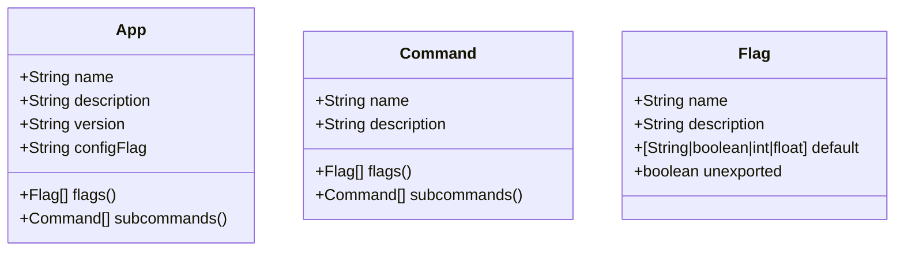

# go-cli-boilerplate
`go-cli-boilerplate` is a modular piece of Go code using which you can build any CLI application from a single YAML schema.<!-- It is written to be minimal and functions similar to [spf13/cobra][cobra].-->

<!--
> This project is clearly not as functional as [cobra][cobra], but gets the job done if you're looking for something minimal. This project can also be used as a reference as my motive for this project was to use [reflection][reflection] and [code generation][code-generation] in Go.
-->

## Quickstart
Using this project is very easy. All you have to do is:
- Clone this repository and open the cloned directory.
  ```sh
  git clone https://github.com/UtkarshVerma/go-cli-generator example-app
  cd example-app
  ``` 
- Generate the CLI files.
  ```sh
  # This command will read `cli/schema.yaml` and generate the appropriate code
  go generate
  ```
- Run the project or build it, whichever is convenient for you.
  ```sh
  $ go build
  $ ./example-app greet
  Ohayou-gozaimsu, Utkarsh-san!
  ```

That's it! You don't have to bother about the scaffolding and defining the flags yourself, the code takes care of everything by itself.

## Usage
The entire CLI can be defined using [`cli/schema.yaml`][schema]. Once that's done, then the project's `main.go` file must be modified to use the CLI.

### Configuration
#### Schema
The YAML schema comprises of three units, the app, commands and the flags, which are defined as follows.

![YAML Units][yaml-fig]
<!--

-->

##### Optional Fields
These fields are optional:
- `version`: Omitting this disables the `version` flag from the CLI.
- `configFlag`: Omitting this disables config file support. Name of flag containing path to config file should be used as a value, in case config is to be enabled.
- `default`: This field defaults to empty string, i.e `""`. This field specified the default value for a flag.
- `unexported`: If the config is enabled, then setting this value to `true` avoids writing the flag to the config file. This is useful for runtime flags.

#### Using the CLI and config
The CLI and config parameters can be accessed through the `cli.App` and `config.App` structs. For example, they have been used in [`main.go`][main] to greet the user depending on the time of the day.

[cobra]: https://github.com/spf13/cobra
[schema]: https://github.com/UtkarshVerma/go-cli-boilerplate
[main]: htt
[reflection]: https://blog.golang.org/laws-of-reflection
[code-generation]: https://blog.golang.org/generate
[yaml-fig]: https://mermaid.ink/img/eyJjb2RlIjoiY2xhc3NEaWFncmFtXG4gICAgY2xhc3MgQXBwIHtcbiAgICAgICAgK1N0cmluZyBuYW1lXG4gICAgICAgICtTdHJpbmcgZGVzY3JpcHRpb25cbiAgICAgICAgK1N0cmluZyB2ZXJzaW9uXG4gICAgICAgICtTdHJpbmcgY29uZmlnRmxhZ1xuICAgICAgICArRmxhZ1tdIGZsYWdzKClcbiAgICAgICAgK0NvbW1hbmRbXSBzdWJjb21tYW5kcygpXG4gICAgfVxuXG4gICAgY2xhc3MgQ29tbWFuZCB7XG4gICAgICAgICtTdHJpbmcgbmFtZVxuICAgICAgICArU3RyaW5nIGRlc2NyaXB0aW9uXG4gICAgICAgICtGbGFnW10gZmxhZ3MoKVxuICAgICAgICArQ29tbWFuZFtdIHN1YmNvbW1hbmRzKClcbiAgICB9XG5cbiAgICBjbGFzcyBGbGFnIHtcbiAgICAgICAgK1N0cmluZyBuYW1lXG4gICAgICAgICtTdHJpbmcgZGVzY3JpcHRpb25cbiAgICAgICAgK1tTdHJpbmd8Ym9vbGVhbnxpbnR8ZmxvYXRdIGRlZmF1bHRcbiAgICAgICAgK2Jvb2xlYW4gdW5leHBvcnRlZFxuICAgIH0iLCJtZXJtYWlkIjp7InRoZW1lIjoiZGVmYXVsdCIsInRoZW1lVmFyaWFibGVzIjp7ImJhY2tncm91bmQiOiJ3aGl0ZSIsInByaW1hcnlDb2xvciI6IiNFQ0VDRkYiLCJzZWNvbmRhcnlDb2xvciI6IiNmZmZmZGUiLCJ0ZXJ0aWFyeUNvbG9yIjoiaHNsKDgwLCAxMDAlLCA5Ni4yNzQ1MDk4MDM5JSkiLCJwcmltYXJ5Qm9yZGVyQ29sb3IiOiJoc2woMjQwLCA2MCUsIDg2LjI3NDUwOTgwMzklKSIsInNlY29uZGFyeUJvcmRlckNvbG9yIjoiaHNsKDYwLCA2MCUsIDgzLjUyOTQxMTc2NDclKSIsInRlcnRpYXJ5Qm9yZGVyQ29sb3IiOiJoc2woODAsIDYwJSwgODYuMjc0NTA5ODAzOSUpIiwicHJpbWFyeVRleHRDb2xvciI6IiMxMzEzMDAiLCJzZWNvbmRhcnlUZXh0Q29sb3IiOiIjMDAwMDIxIiwidGVydGlhcnlUZXh0Q29sb3IiOiJyZ2IoOS41MDAwMDAwMDAxLCA5LjUwMDAwMDAwMDEsIDkuNTAwMDAwMDAwMSkiLCJsaW5lQ29sb3IiOiIjMzMzMzMzIiwidGV4dENvbG9yIjoiIzMzMyIsIm1haW5Ca2ciOiIjRUNFQ0ZGIiwic2Vjb25kQmtnIjoiI2ZmZmZkZSIsImJvcmRlcjEiOiIjOTM3MERCIiwiYm9yZGVyMiI6IiNhYWFhMzMiLCJhcnJvd2hlYWRDb2xvciI6IiMzMzMzMzMiLCJmb250RmFtaWx5IjoiXCJ0cmVidWNoZXQgbXNcIiwgdmVyZGFuYSwgYXJpYWwiLCJmb250U2l6ZSI6IjE2cHgiLCJsYWJlbEJhY2tncm91bmQiOiIjZThlOGU4Iiwibm9kZUJrZyI6IiNFQ0VDRkYiLCJub2RlQm9yZGVyIjoiIzkzNzBEQiIsImNsdXN0ZXJCa2ciOiIjZmZmZmRlIiwiY2x1c3RlckJvcmRlciI6IiNhYWFhMzMiLCJkZWZhdWx0TGlua0NvbG9yIjoiIzMzMzMzMyIsInRpdGxlQ29sb3IiOiIjMzMzIiwiZWRnZUxhYmVsQmFja2dyb3VuZCI6IiNlOGU4ZTgiLCJhY3RvckJvcmRlciI6ImhzbCgyNTkuNjI2MTY4MjI0MywgNTkuNzc2NTM2MzEyOCUsIDg3LjkwMTk2MDc4NDMlKSIsImFjdG9yQmtnIjoiI0VDRUNGRiIsImFjdG9yVGV4dENvbG9yIjoiYmxhY2siLCJhY3RvckxpbmVDb2xvciI6ImdyZXkiLCJzaWduYWxDb2xvciI6IiMzMzMiLCJzaWduYWxUZXh0Q29sb3IiOiIjMzMzIiwibGFiZWxCb3hCa2dDb2xvciI6IiNFQ0VDRkYiLCJsYWJlbEJveEJvcmRlckNvbG9yIjoiaHNsKDI1OS42MjYxNjgyMjQzLCA1OS43NzY1MzYzMTI4JSwgODcuOTAxOTYwNzg0MyUpIiwibGFiZWxUZXh0Q29sb3IiOiJibGFjayIsImxvb3BUZXh0Q29sb3IiOiJibGFjayIsIm5vdGVCb3JkZXJDb2xvciI6IiNhYWFhMzMiLCJub3RlQmtnQ29sb3IiOiIjZmZmNWFkIiwibm90ZVRleHRDb2xvciI6ImJsYWNrIiwiYWN0aXZhdGlvbkJvcmRlckNvbG9yIjoiIzY2NiIsImFjdGl2YXRpb25Ca2dDb2xvciI6IiNmNGY0ZjQiLCJzZXF1ZW5jZU51bWJlckNvbG9yIjoid2hpdGUiLCJzZWN0aW9uQmtnQ29sb3IiOiJyZ2JhKDEwMiwgMTAyLCAyNTUsIDAuNDkpIiwiYWx0U2VjdGlvbkJrZ0NvbG9yIjoid2hpdGUiLCJzZWN0aW9uQmtnQ29sb3IyIjoiI2ZmZjQwMCIsInRhc2tCb3JkZXJDb2xvciI6IiM1MzRmYmMiLCJ0YXNrQmtnQ29sb3IiOiIjOGE5MGRkIiwidGFza1RleHRMaWdodENvbG9yIjoid2hpdGUiLCJ0YXNrVGV4dENvbG9yIjoid2hpdGUiLCJ0YXNrVGV4dERhcmtDb2xvciI6ImJsYWNrIiwidGFza1RleHRPdXRzaWRlQ29sb3IiOiJibGFjayIsInRhc2tUZXh0Q2xpY2thYmxlQ29sb3IiOiIjMDAzMTYzIiwiYWN0aXZlVGFza0JvcmRlckNvbG9yIjoiIzUzNGZiYyIsImFjdGl2ZVRhc2tCa2dDb2xvciI6IiNiZmM3ZmYiLCJncmlkQ29sb3IiOiJsaWdodGdyZXkiLCJkb25lVGFza0JrZ0NvbG9yIjoibGlnaHRncmV5IiwiZG9uZVRhc2tCb3JkZXJDb2xvciI6ImdyZXkiLCJjcml0Qm9yZGVyQ29sb3IiOiIjZmY4ODg4IiwiY3JpdEJrZ0NvbG9yIjoicmVkIiwidG9kYXlMaW5lQ29sb3IiOiJyZWQiLCJsYWJlbENvbG9yIjoiYmxhY2siLCJlcnJvckJrZ0NvbG9yIjoiIzU1MjIyMiIsImVycm9yVGV4dENvbG9yIjoiIzU1MjIyMiIsImNsYXNzVGV4dCI6IiMxMzEzMDAiLCJmaWxsVHlwZTAiOiIjRUNFQ0ZGIiwiZmlsbFR5cGUxIjoiI2ZmZmZkZSIsImZpbGxUeXBlMiI6ImhzbCgzMDQsIDEwMCUsIDk2LjI3NDUwOTgwMzklKSIsImZpbGxUeXBlMyI6ImhzbCgxMjQsIDEwMCUsIDkzLjUyOTQxMTc2NDclKSIsImZpbGxUeXBlNCI6ImhzbCgxNzYsIDEwMCUsIDk2LjI3NDUwOTgwMzklKSIsImZpbGxUeXBlNSI6ImhzbCgtNCwgMTAwJSwgOTMuNTI5NDExNzY0NyUpIiwiZmlsbFR5cGU2IjoiaHNsKDgsIDEwMCUsIDk2LjI3NDUwOTgwMzklKSIsImZpbGxUeXBlNyI6ImhzbCgxODgsIDEwMCUsIDkzLjUyOTQxMTc2NDclKSJ9fSwidXBkYXRlRWRpdG9yIjpmYWxzZX0
